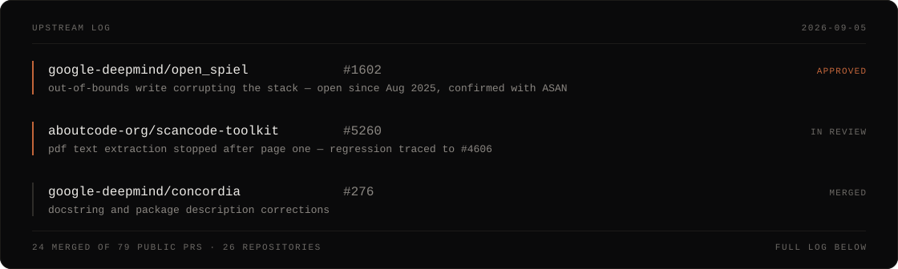

<a href="https://github.com/codewithfourtix/codewithfourtix">
  <picture>
    <source media="(prefers-color-scheme: dark)" srcset="https://raw.githubusercontent.com/codewithfourtix/codewithfourtix/main/dark_mode.svg">
    
  </picture>
</a>

## Skills

<table><tr><td valign="top" width="33%">

### Frontend  

  
     
     
     
    
   
    
    
    
  <!--  -->
  <!--  -->
  
  <!--  -->
  <!--  -->
  <!--  -->

</td><td valign="top" width="33%">

### Backend  

  
    
    
    
  <!--    -->
  <!--    -->
    
    
  <!--    -->
    
    
     
    
    
  
  <!--  -->

</td><td valign="top" width="33%">

### Other  

  
    
  
    
    
    
   
  
  <!--  -->
  <!--  -->
  <!--  -->
  
  <!--  -->

</td></tr>
</table>

 

## Open source

Mostly bug fixes in projects I actually use. Every PR below links to its review.

**[All public PRs](https://github.com/search?q=is%3Apr+author%3Acodewithfourtix+is%3Apublic&type=pullrequests)** · **[Merged](https://github.com/search?q=is%3Apr+author%3Acodewithfourtix+is%3Amerged+is%3Apublic&type=pullrequests)** · **[Open](https://github.com/search?q=is%3Apr+author%3Acodewithfourtix+is%3Aopen+is%3Apublic&type=pullrequests)** · **[Closed](https://github.com/search?q=is%3Apr+author%3Acodewithfourtix+is%3Aclosed+is%3Aunmerged+is%3Apublic&type=pullrequests)**

### Merged into the community

| Project | Contribution |
| :--- | :--- |
| **google-deepmind/concordia** | [Fix typos in document docstrings and package description · #276](https://github.com/google-deepmind/concordia/pull/276) |
| **aboutcode-org/scancode-toolkit** | [Remove duplicate &#x27;/project.clj&#x27; key in _MANIFEST_ENDS dict · #4781](https://github.com/aboutcode-org/scancode-toolkit/pull/4781) |
| **zeroclaw-labs/zeroclaw** | [docs: fix OAuth wording, binary size format, E.164 phone prefix, and … · #1296](https://github.com/zeroclaw-labs/zeroclaw/pull/1296) |
| **sipeed/picoclaw** | [docs: fix typos, broken links and inconsistencies in README · #608](https://github.com/sipeed/picoclaw/pull/608) |
| **theajmalrazaq/superflex** | [fix(ui): add pointer cursors to interactive elements for better UX · #24](https://github.com/theajmalrazaq/superflex/pull/24) |
| **aounkazmi-dev/Car-Show-Speed** | [Update: Uploading my phases · #1](https://github.com/aounkazmi-dev/Car-Show-Speed/pull/1) |

### Community contributions

**60 PRs · 6 merged · 52 open · 2 closed**

Expand a repository to see every contribution. Open PRs are proposals awaiting review or merge.

<b>aboutcode-org/scancode-toolkit</b> &nbsp; · &nbsp; 1 merged · 5 open

| Status | PR | Contribution |
| :--- | :--- | :--- |
| 🟣 Merged | [#4781](https://github.com/aboutcode-org/scancode-toolkit/pull/4781) | Remove duplicate &#x27;/project.clj&#x27; key in _MANIFEST_ENDS dict |
| 🟢 Open | [#5260](https://github.com/aboutcode-org/scancode-toolkit/pull/5260) | Fix pdf text extraction multipage |
| 🟢 Open | [#4786](https://github.com/aboutcode-org/scancode-toolkit/pull/4786) | Fix end_line incorrectly assigned from start_line in CSV output #4785 |
| 🟢 Open | [#4784](https://github.com/aboutcode-org/scancode-toolkit/pull/4784) | Fix empty range in terminate_pool_with_backoff making it a no-op |
| 🟢 Open | [#4783](https://github.com/aboutcode-org/scancode-toolkit/pull/4783) | Fix incorrect timing parameter passed to run_scanners |
| 🟢 Open | [#4782](https://github.com/aboutcode-org/scancode-toolkit/pull/4782) | Fix unreachable JSON validation code in validate_input_path |

<b>aounkazmi-dev/Car-Show-Speed</b> &nbsp; · &nbsp; 1 merged · 1 closed

| Status | PR | Contribution |
| :--- | :--- | :--- |
| 🟣 Merged | [#1](https://github.com/aounkazmi-dev/Car-Show-Speed/pull/1) | Update: Uploading my phases |
| ⚪ Closed | [#2](https://github.com/aounkazmi-dev/Car-Show-Speed/pull/2) | removing redirectives |

<b>google-deepmind/concordia</b> &nbsp; · &nbsp; 1 merged · 2 open

| Status | PR | Contribution |
| :--- | :--- | :--- |
| 🟣 Merged | [#276](https://github.com/google-deepmind/concordia/pull/276) | Fix typos in document docstrings and package description |
| 🟢 Open | [#300](https://github.com/google-deepmind/concordia/pull/300) | Allow component comparisons without skip_keys |
| 🟢 Open | [#299](https://github.com/google-deepmind/concordia/pull/299) | Honor remove_duplicates when searching nested data |

<b>sipeed/picoclaw</b> &nbsp; · &nbsp; 1 merged

| Status | PR | Contribution |
| :--- | :--- | :--- |
| 🟣 Merged | [#608](https://github.com/sipeed/picoclaw/pull/608) | docs: fix typos, broken links and inconsistencies in README |

<b>theajmalrazaq/superflex</b> &nbsp; · &nbsp; 1 merged

| Status | PR | Contribution |
| :--- | :--- | :--- |
| 🟣 Merged | [#24](https://github.com/theajmalrazaq/superflex/pull/24) | fix(ui): add pointer cursors to interactive elements for better UX |

<b>zeroclaw-labs/zeroclaw</b> &nbsp; · &nbsp; 1 merged

| Status | PR | Contribution |
| :--- | :--- | :--- |
| 🟣 Merged | [#1296](https://github.com/zeroclaw-labs/zeroclaw/pull/1296) | docs: fix OAuth wording, binary size format, E.164 phone prefix, and … |

<b>aboutcode-org/commoncode</b> &nbsp; · &nbsp; 2 open

| Status | PR | Contribution |
| :--- | :--- | :--- |
| 🟢 Open | [#110](https://github.com/aboutcode-org/commoncode/pull/110) | Scale fractional timestamp seconds to microseconds |
| 🟢 Open | [#109](https://github.com/aboutcode-org/commoncode/pull/109) | Raise URNValidationError for truncated URNs |

<b>aboutcode-org/fetchcode</b> &nbsp; · &nbsp; 12 open

| Status | PR | Contribution |
| :--- | :--- | :--- |
| 🟢 Open | [#215](https://github.com/aboutcode-org/fetchcode/pull/215) | Follow Bitbucket tag pages when collecting package releases |
| 🟢 Open | [#214](https://github.com/aboutcode-org/fetchcode/pull/214) | Fetch NuGet registration pages when versions are not inlined |
| 🟢 Open | [#213](https://github.com/aboutcode-org/fetchcode/pull/213) | Filter Composer development versions by their version value |
| 🟢 Open | [#212](https://github.com/aboutcode-org/fetchcode/pull/212) | Skip missing upload timestamps when finding PyPI release dates |
| 🟢 Open | [#211](https://github.com/aboutcode-org/fetchcode/pull/211) | Read npm licenses from the selected release |
| 🟢 Open | [#210](https://github.com/aboutcode-org/fetchcode/pull/210) | Preserve npm scopes when fetching package metadata |
| 🟢 Open | [#209](https://github.com/aboutcode-org/fetchcode/pull/209) | Handle absent CocoaPods versions and homepage metadata |
| 🟢 Open | [#208](https://github.com/aboutcode-org/fetchcode/pull/208) | Handle GitHub tags whose targets have no commit date |
| 🟢 Open | [#207](https://github.com/aboutcode-org/fetchcode/pull/207) | Use CocoaPods source tags without changing package versions |
| 🟢 Open | [#206](https://github.com/aboutcode-org/fetchcode/pull/206) | Match CocoaPods names exactly when reading version lists |
| 🟢 Open | [#205](https://github.com/aboutcode-org/fetchcode/pull/205) | Preserve prerelease suffixes when normalizing GitHub tags |
| 🟢 Open | [#204](https://github.com/aboutcode-org/fetchcode/pull/204) | Keep GitHub package tags with no release date |

<b>aboutcode-org/license-expression</b> &nbsp; · &nbsp; 3 open

| Status | PR | Contribution |
| :--- | :--- | :--- |
| 🟢 Open | [#137](https://github.com/aboutcode-org/license-expression/pull/137) | Return warnings for duplicate and empty license aliases |
| 🟢 Open | [#136](https://github.com/aboutcode-org/license-expression/pull/136) | Recheck remaining tokens after removing an overlapping match |
| 🟢 Open | [#135](https://github.com/aboutcode-org/license-expression/pull/135) | Normalize relation case when combining license expressions |

<b>aboutcode-org/python-inspector</b> &nbsp; · &nbsp; 3 open

| Status | PR | Contribution |
| :--- | :--- | :--- |
| 🟢 Open | [#271](https://github.com/aboutcode-org/python-inspector/pull/271) | Remove exact archive suffixes when locating extracted sdists |
| 🟢 Open | [#270](https://github.com/aboutcode-org/python-inspector/pull/270) | Preserve case and quoted spaces in dependency requirements |
| 🟢 Open | [#269](https://github.com/aboutcode-org/python-inspector/pull/269) | Do not treat wildcard requirements as exact version pins |

<b>anthropics/anthropic-sdk-python</b> &nbsp; · &nbsp; 1 open

| Status | PR | Contribution |
| :--- | :--- | :--- |
| 🟢 Open | [#1913](https://github.com/anthropics/anthropic-sdk-python/pull/1913) | fix(tools): preserve an explicitly empty description |

<b>google-deepmind/open_spiel</b> &nbsp; · &nbsp; 1 open

| Status | PR | Contribution |
| :--- | :--- | :--- |
| 🟢 Open | [#1602](https://github.com/google-deepmind/open_spiel/pull/1602) | Fix out-of-bounds write in dou_dizhu when nobody wins the auction |

<b>google-deepmind/optax</b> &nbsp; · &nbsp; 2 open

| Status | PR | Contribution |
| :--- | :--- | :--- |
| 🟢 Open | [#1716](https://github.com/google-deepmind/optax/pull/1716) | Fix ACProp second moment to use the new first moment |
| 🟢 Open | [#1715](https://github.com/google-deepmind/optax/pull/1715) | Fix incorrect (1 - b2) coefficient in scale_by_adan |

<b>google-deepmind/regress-lm</b> &nbsp; · &nbsp; 1 open

| Status | PR | Contribution |
| :--- | :--- | :--- |
| 🟢 Open | [#139](https://github.com/google-deepmind/regress-lm/pull/139) | docs: fix broken Extended Usage navigation link in README |

<b>huggingface/evaluate</b> &nbsp; · &nbsp; 2 open

| Status | PR | Contribution |
| :--- | :--- | :--- |
| 🟢 Open | [#809](https://github.com/huggingface/evaluate/pull/809) | Recognize existing directories with dots when saving results |
| 🟢 Open | [#808](https://github.com/huggingface/evaluate/pull/808) | Allow saving evaluation results when Git is not installed |

<b>mahmoud/boltons</b> &nbsp; · &nbsp; 10 open

| Status | PR | Contribution |
| :--- | :--- | :--- |
| 🟢 Open | [#472](https://github.com/mahmoud/boltons/pull/472) | Keep the stop barrel valid during cross-barrel deletion |
| 🟢 Open | [#471](https://github.com/mahmoud/boltons/pull/471) | Normalize BarrelList slice bounds and reverse steps |
| 🟢 Open | [#470](https://github.com/mahmoud/boltons/pull/470) | Reject BarrelList item indexes past the end |
| 🟢 Open | [#469](https://github.com/mahmoud/boltons/pull/469) | Support aware datetimes when relative time defaults to now |
| 🟢 Open | [#468](https://github.com/mahmoud/boltons/pull/468) | Preserve empty Bits across binary and byte conversions |
| 🟢 Open | [#467](https://github.com/mahmoud/boltons/pull/467) | Handle zero interquartile range in automatic histograms |
| 🟢 Open | [#466](https://github.com/mahmoud/boltons/pull/466) | Keep text streams usable after reverse iteration |
| 🟢 Open | [#465](https://github.com/mahmoud/boltons/pull/465) | Accept the documented end position in JSONLIterator |
| 🟢 Open | [#464](https://github.com/mahmoud/boltons/pull/464) | Support relative seeking in binary JSONL streams |
| 🟢 Open | [#463](https://github.com/mahmoud/boltons/pull/463) | Honor the encoding when reading lines in reverse |

<b>openai/whisper</b> &nbsp; · &nbsp; 2 open

| Status | PR | Contribution |
| :--- | :--- | :--- |
| 🟢 Open | [#2847](https://github.com/openai/whisper/pull/2847) | Escape timestamp arrows in word-level subtitles |
| 🟢 Open | [#2846](https://github.com/openai/whisper/pull/2846) | Keep each transcript segment on one TSV row |

<b>package-url/packageurl-python</b> &nbsp; · &nbsp; 3 open

| Status | PR | Contribution |
| :--- | :--- | :--- |
| 🟢 Open | [#237](https://github.com/package-url/packageurl-python/pull/237) | Skip Swift archive URLs when namespace or version is missing |
| 🟢 Open | [#236](https://github.com/package-url/packageurl-python/pull/236) | Preserve package names inside npm prerelease versions |
| 🟢 Open | [#235](https://github.com/package-url/packageurl-python/pull/235) | Avoid crashing on Go package URLs without a version |

<b>RocketChat/Rocket.Chat</b> &nbsp; · &nbsp; 2 open

| Status | PR | Contribution |
| :--- | :--- | :--- |
| 🟢 Open | [#41030](https://github.com/RocketChat/Rocket.Chat/pull/41030) | fix: Encrypted toggle ignored when creating a discussion |
| 🟢 Open | [#41028](https://github.com/RocketChat/Rocket.Chat/pull/41028) | i18n: Fix spelling errors in English source strings |

<b>sgl-project/sglang</b> &nbsp; · &nbsp; 1 open

| Status | PR | Contribution |
| :--- | :--- | :--- |
| 🟢 Open | [#28845](https://github.com/sgl-project/sglang/pull/28845) | Fix Llama32 tool-call parser truncating text after final call |

<b>ShaiqRaza/portfolioWebsiteFrontend</b> &nbsp; · &nbsp; 1 closed

| Status | PR | Contribution |
| :--- | :--- | :--- |
| ⚪ Closed | [#1](https://github.com/ShaiqRaza/portfolioWebsiteFrontend/pull/1) | Media Query issue &amp;&amp; unneccesary imports  |

### Built in my own repositories

**19 public PRs · 18 merged · 1 open**

The shipping history of my own projects, listed separately from community contributions.

<b>codewithfourtix/Car-Show-Speed</b> &nbsp; · &nbsp; 2 merged

| Status | PR | Contribution |
| :--- | :--- | :--- |
| 🟣 Merged | [#2](https://github.com/codewithfourtix/Car-Show-Speed/pull/2) | Tested final version &amp;&amp; Updating fileName |
| 🟣 Merged | [#1](https://github.com/codewithfourtix/Car-Show-Speed/pull/1) | removing directives |

<b>codewithfourtix/descon-design</b> &nbsp; · &nbsp; 1 merged

| Status | PR | Contribution |
| :--- | :--- | :--- |
| 🟣 Merged | [#1](https://github.com/codewithfourtix/descon-design/pull/1) | Changes |

<b>codewithfourtix/ember</b> &nbsp; · &nbsp; 5 merged

| Status | PR | Contribution |
| :--- | :--- | :--- |
| 🟣 Merged | [#5](https://github.com/codewithfourtix/ember/pull/5) | CI, tokenizer fix, and the --bench throughput harness |
| 🟣 Merged | [#4](https://github.com/codewithfourtix/ember/pull/4) | Phase 3: chat mode + kernel unit tests |
| 🟣 Merged | [#3](https://github.com/codewithfourtix/ember/pull/3) | Phase 2: INT8 / group-wise INT4 quantization |
| 🟣 Merged | [#2](https://github.com/codewithfourtix/ember/pull/2) | Phase 1: a working f32 forward pass (generates coherent text) |
| 🟣 Merged | [#1](https://github.com/codewithfourtix/ember/pull/1) | Project scaffold: modules, CLI, and correctness harness |

<b>codewithfourtix/lofotixtest</b> &nbsp; · &nbsp; 2 merged · 1 open

| Status | PR | Contribution |
| :--- | :--- | :--- |
| 🟣 Merged | [#2](https://github.com/codewithfourtix/lofotixtest/pull/2) | FTUR: Email added automatically to view lost and found to enhance cre… |
| 🟣 Merged | [#1](https://github.com/codewithfourtix/lofotixtest/pull/1) | FTUR: Logic feature merge |
| 🟢 Open | [#3](https://github.com/codewithfourtix/lofotixtest/pull/3) | Manage items |

<b>codewithfourtix/sachbatao</b> &nbsp; · &nbsp; 8 merged

| Status | PR | Contribution |
| :--- | :--- | :--- |
| 🟣 Merged | [#9](https://github.com/codewithfourtix/sachbatao/pull/9) | feat(feedback): durably persist feedback labels |
| 🟣 Merged | [#8](https://github.com/codewithfourtix/sachbatao/pull/8) | Feat/guardrails |
| 🟣 Merged | [#7](https://github.com/codewithfourtix/sachbatao/pull/7) | fix(whatsapp): clear stale Chromium locks on startup |
| 🟣 Merged | [#5](https://github.com/codewithfourtix/sachbatao/pull/5) | feat: per-sender rate limiting to cap API cost |
| 🟣 Merged | [#4](https://github.com/codewithfourtix/sachbatao/pull/4) | fix(detector): always return a verdict for image/PDF content |
| 🟣 Merged | [#3](https://github.com/codewithfourtix/sachbatao/pull/3) | fix(deploy): bump Docker image to Node 20 for pdf-parse |
| 🟣 Merged | [#2](https://github.com/codewithfourtix/sachbatao/pull/2) | Add image (OCR) and PDF fraud checking |
| 🟣 Merged | [#1](https://github.com/codewithfourtix/sachbatao/pull/1) | Feature/google cloud tts |

Status snapshot: September 5, 2026. Counts cover public PRs only; the links above show current GitHub activity. Closed means closed without merge.
